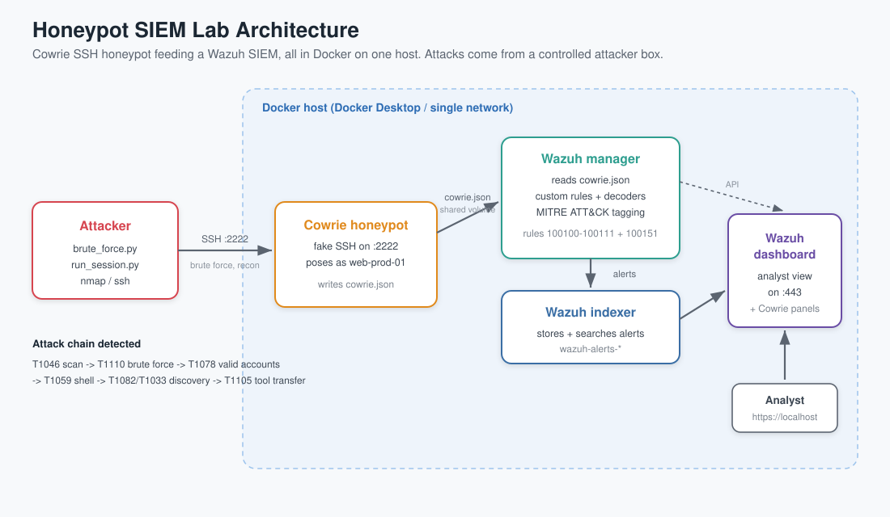
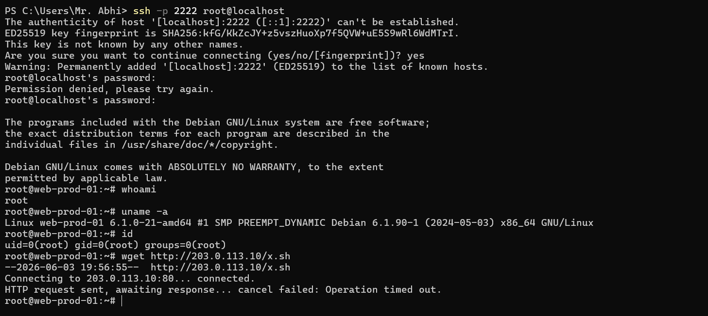
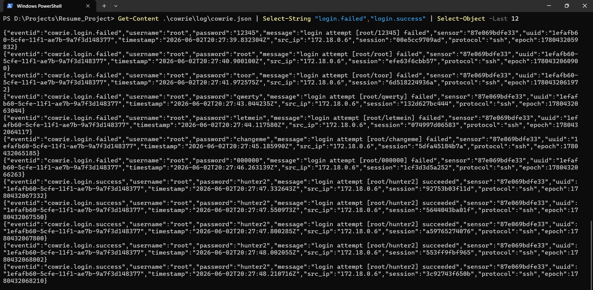
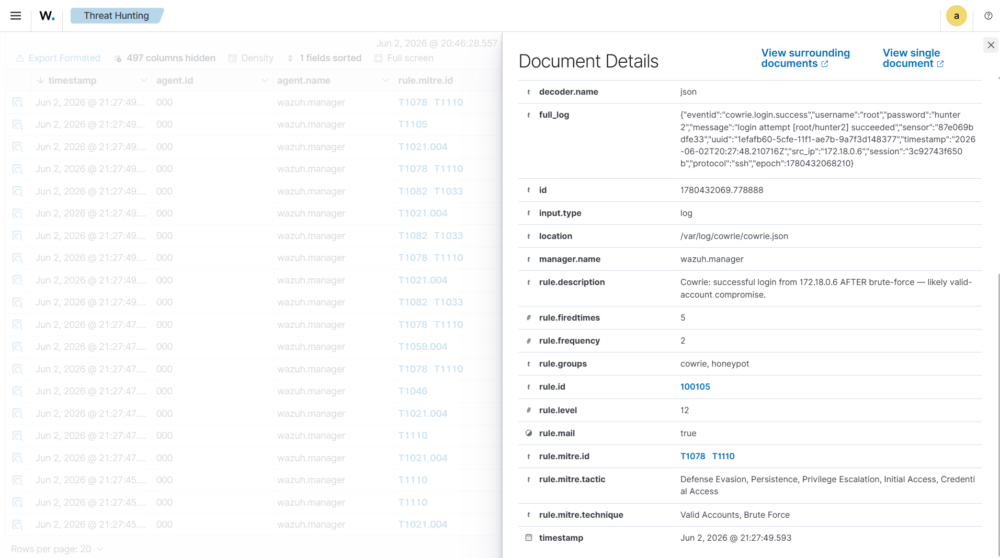
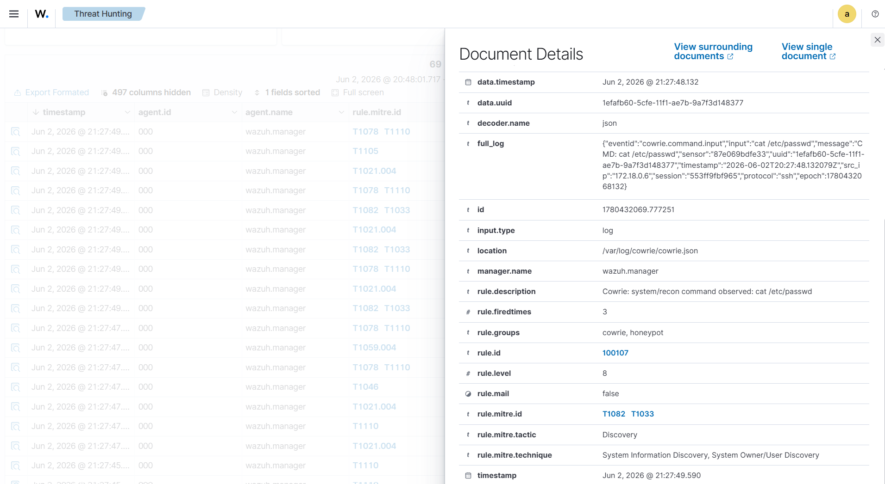
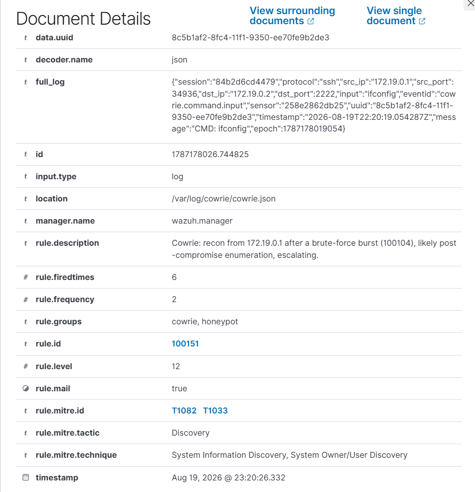
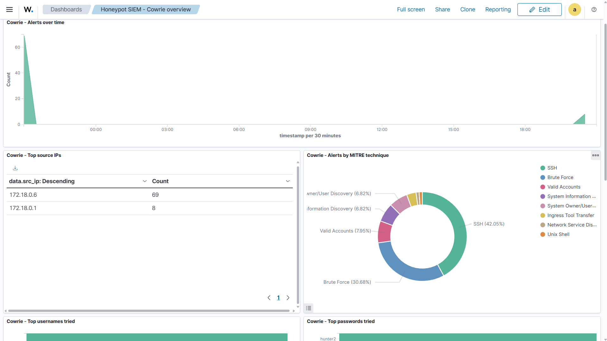
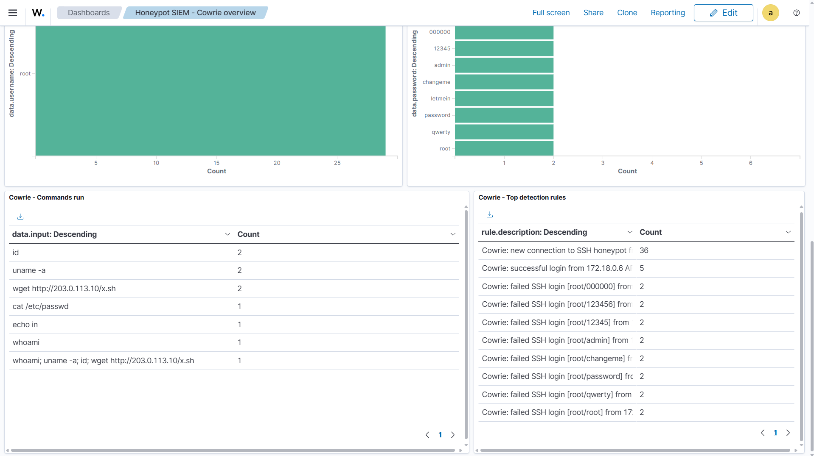
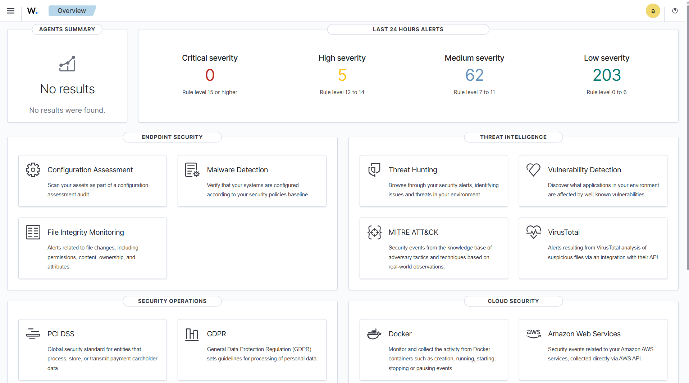

# Honeypot SIEM, Purple-Team Detection Lab

A self-contained purple-team lab that runs an **SSH honeypot (Cowrie)**, ships
its events into a **SIEM (Wazuh)**, and detects simulated attacks with custom
detection rules **mapped to MITRE ATT&CK**. Built end-to-end in Docker on a
single machine, attack it, detect it, document it.

> **Stack:** Wazuh 4.9 (SIEM) · Cowrie (SSH honeypot) · Docker Compose · Python
> (paramiko) attacker · MITRE ATT&CK · Microsoft Sentinel + KQL (bonus)

**Coverage at a glance:** 12 custom Wazuh detection rules mapped to **9 MITRE
ATT&CK techniques across 6 tactics** (Lateral Movement, Credential Access,
Initial Access, Execution, Discovery, Command & Control), including
frequency-based correlation (brute force, account takeover) and context-based
escalation (recon on an already-compromised host), all validated end-to-end
against live simulated attacks.

> **Part of a three-project SOC workflow.** This repo is the **detection
> engineering**. Its alerts feed
> [`soar-triage`](https://github.com/themodernhacker/soar-triage), the
> **automated first-response** that enriches, decides, and files a ticket the
> instant an alert fires; and the tickets worth a closer look become a full
> [`incident-investigation-report`](https://github.com/themodernhacker/incident-investigation-report)
> (NIST SP 800-61). Detection to automated triage to investigation.



---

## What this demonstrates

- **Detection engineering**: 12 custom Wazuh rules with frequency-based
  correlation and context-based escalation (brute force, post-brute-force
  compromise, recon on a compromised host), in version control:
  [`rules/local_rules.xml`](rules/local_rules.xml)
- **MITRE ATT&CK mapping**: every alert tagged to a technique:
  [`docs/MITRE-MAPPING.md`](docs/MITRE-MAPPING.md)
- **Log pipeline design**: Cowrie JSON to Wazuh manager via a shared volume,
  no host agent, fully reproducible from this repo
- **Purple-team workflow**: scripted, controlled attacks and the analysis of
  the resulting alerts: [`attack/`](attack/)
- **Cross-SIEM detections**: the same rules rewritten in KQL for Microsoft
  Sentinel: [`sentinel/`](sentinel/)
- **Detection-as-code testing**: a test suite that replays events through
  `wazuh-logtest` and asserts the right rule fires, so a rule change can't
  silently break a detection: [`tests/`](tests/)

---

## Architecture

```
┌────────────┐   SSH :2222    ┌─────────────┐   cowrie.json   ┌──────────────────┐
│  Attacker  │ ─────────────► │   Cowrie    │ ──────────────► │  Wazuh Manager   │
│ (scripts/  │  brute-force,  │  honeypot   │  (shared vol)   │  decoders+rules  │
│  nmap/ssh) │  recon, wget   │  (Docker)   │                 │  MITRE tagging   │
└────────────┘                └─────────────┘                 └────────┬─────────┘
                                                                        │
                                                              ┌─────────▼─────────┐
                                                              │ Wazuh Indexer +   │
                                                              │ Dashboard (:443)  │
                                                              └───────────────────┘
```

## Quick start

Full instructions: [`docs/SETUP.md`](docs/SETUP.md). In short (Windows + Docker
Desktop, from the repo root):

```powershell
git clone https://github.com/wazuh/wazuh-docker.git -b v4.9.0
cd wazuh-docker\single-node
docker compose -f generate-indexer-certs.yml run --rm generator
copy ..\..\wazuh\docker-compose.override.yml .\docker-compose.override.yml
# add the <localfile> block from wazuh/manager-localfile-snippet.xml to
#   config\wazuh_cluster\wazuh_manager.conf
docker compose up -d
pwsh ..\..\wazuh\apply-custom-rules.ps1   # inject custom rules once stack is healthy
# open https://localhost  (change the default admin password!)
```

Then run the attacks:

```powershell
cd ..\..\attack
pip install paramiko
.\scan.ps1
python brute_force.py
python run_session.py
```

---

## Detections & MITRE coverage

| Detection | ATT&CK | Rule |
|-----------|--------|:----:|
| SSH brute force (8+ fails/120s, one source) | T1110 | 100104 |
| Successful login after brute force | T1078 + T1110 | 100105 |
| Remote payload download (`wget`/`curl`) | T1105 | 100108/109 |
| Recon commands (`uname`,`id`,...) | T1082 + T1033 | 100107 |
| Recon by a source that just brute-forced in (escalation) | T1082 + T1033 | 100151 |
| Rapid connections / automation | T1046 | 100110 |
| Tunnel/proxy via honeypot | T1090 | 100111 |

Full table: [`docs/MITRE-MAPPING.md`](docs/MITRE-MAPPING.md).

---

## Walkthrough

A run through the lab, from the attack to the detections.

**1. Attack the honeypot.** A brute force against the SSH port, then a login
with the password that worked, then some poking around. The shell lands on the
fake host `web-prod-01`.



**2. The honeypot records every attempt.** Cowrie writes each login as a line of
JSON. Here are the failed guesses followed by the successful `root/hunter2`.



**3. Wazuh turns the logs into alerts.** The successful login that follows a
brute force burst fires the level 12 compromise rule (100105), tagged with the
MITRE techniques it represents.



**4. Post-access activity is caught too.** The recon commands run inside the
session map to discovery techniques (100107, T1082 and T1033).



**5. Recon after a break-in escalates on its own.** Those same discovery commands,
when they come from a source that just brute-forced its way in, promote from a
level 8 review signal to a level 12 page via rule 100151, so post-compromise
enumeration stands out from the routine kind.



**6. The dashboard ties it together.** Top source IPs, a MITRE technique
breakdown, the passwords tried, and the commands run, all scoped to the honeypot.




**7. And it all rolls up to the Wazuh overview.**



---

## Write-ups

Attack-by-attack analysis (log to rule that caught it to MITRE technique to what an
analyst does next) lives in [`docs/`](docs):

- [Brute force into an account takeover](docs/writeup-brute-force.md)
- [Looking around after getting in](docs/writeup-recon.md)
- [Pulling down a second stage](docs/writeup-payload-download.md)
- [Tuning the detections for the real world](docs/writeup-tuning.md) (separating
  signal from noise: allowlisting, context-based escalation, false positives)

---

## What I learned

Real engineering problems I hit and solved while building this (not theory):

- **Wazuh correlation uses specific field names.** `<same_source_ip/>` only works
  on Wazuh's built-in `srcip` field. Cowrie's JSON decodes the address as the
  dynamic field `src_ip`, so my brute-force correlation silently never fired
  until I switched to `<same_field>src_ip</same_field>`. Lesson: verify which
  field your correlation actually keys on.
- **My own test caught a detection that silently never fired.** I wrote the
  context-escalation rule (100151) to key off the *compromise* alert (100105), and
  the detection-as-code test asserting its rule ID failed. Wazuh's `if_matched_sid`
  looks back over frequency rules like the brute-force rule (100104), but not over
  a composite that itself fired via `if_matched_sid` (100105). Re-anchoring on
  100104 fixed it. Lesson: assert on rule IDs, not just "an alert fired", or a dead
  rule looks identical to a working one.
- **Bind-mounting into a Docker named volume can break app init.** Mounting rule
  files into `/var/ossec/etc` made Wazuh think the volume was already populated
  and skip copying its default config, so the manager wouldn't start. Fixed by
  injecting rules *after* first boot via `docker cp` (see `apply-custom-rules.ps1`).
- **Honeypot detection has blind spots.** Cowrie only exposes port 2222, so a
  port-scan (T1046) leaves weak evidence on the honeypot itself, the strong
  signal is on the attacker/network side. I represented this honestly rather
  than overstating coverage.
- **Config encoding matters.** Cowrie reads `userdb.txt` as ASCII and crashed on
  a single non-ASCII dash in a comment, which broke all authentication. Small
  byte, big outage, exactly the kind of thing real detection pipelines hit.
- Mapping each detection to MITRE ATT&CK turns a pile of alerts into a readable
  attack story (recon to brute force to compromise to discovery to tool transfer).

---

## Repo layout

```
rules/      custom Wazuh decoders + detection rules (the core artifact)
cowrie/     honeypot config (cowrie.cfg, userdb.txt) + logs (gitignored)
wazuh/      compose override + manager config snippet
attack/     controlled attack scripts (brute force, session, scan)
docs/       setup guide, MITRE mapping, attack write-ups, detection tuning
sentinel/   the same detections in KQL for Microsoft Sentinel (bonus)
tests/      detection-as-code: replay events through wazuh-logtest, assert rule IDs
screenshots/ evidence for the README
```

---

_Lab for educational/defensive security use against my own infrastructure only._
