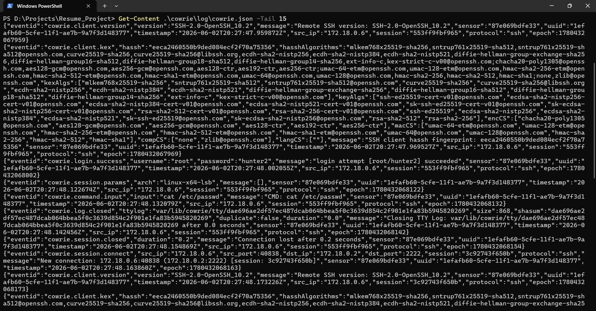

# Honeypot SIEM — Purple-Team Detection Lab

A self-contained purple-team lab that runs an **SSH honeypot (Cowrie)**, ships
its events into a **SIEM (Wazuh)**, and detects simulated attacks with custom
detection rules **mapped to MITRE ATT&CK**. Built end-to-end in Docker on a
single machine — attack it, detect it, document it.

> **Stack:** Wazuh 4.9 (SIEM) · Cowrie (SSH honeypot) · Docker Compose · Python
> (paramiko) attacker · MITRE ATT&CK

 <!-- add a draw.io export here -->

---

## What this demonstrates

- **Detection engineering** — 11 custom Wazuh rules with frequency-based
  correlation (brute force, post-brute-force compromise), in version control:
  [`rules/local_rules.xml`](rules/local_rules.xml)
- **MITRE ATT&CK mapping** — every alert tagged to a technique:
  [`docs/MITRE-MAPPING.md`](docs/MITRE-MAPPING.md)
- **Log pipeline design** — Cowrie JSON → Wazuh manager via a shared volume,
  no host agent, fully reproducible from this repo
- **Purple-team workflow** — scripted, controlled attacks and the analysis of
  the resulting alerts: [`attack/`](attack/)

---

## Architecture

```
┌────────────┐   SSH :2222    ┌─────────────┐   cowrie.json   ┌──────────────────┐
│  Attacker  │ ─────────────► │   Cowrie    │ ──────────────► │  Wazuh Manager   │
│ (scripts/  │  brute-force,  │  honeypot   │  (shared vol)   │  decoders+rules  │
│  nmap/ssh) │  recon, wget   │  (Docker)   │                 │  MITRE tagging   │
└────────────┘                └─────────────┘                 └────────┬─────────┘
                                                                        │
                                                              ┌─────────▼─────────┐
                                                              │ Wazuh Indexer +   │
                                                              │ Dashboard (:443)  │
                                                              └───────────────────┘
```

## Quick start

Full instructions: [`docs/SETUP.md`](docs/SETUP.md). In short (Windows + Docker
Desktop, from the repo root):

```powershell
git clone https://github.com/wazuh/wazuh-docker.git -b v4.9.0
cd wazuh-docker\single-node
docker compose -f generate-indexer-certs.yml run --rm generator
copy ..\..\wazuh\docker-compose.override.yml .\docker-compose.override.yml
# add the <localfile> block from wazuh/manager-localfile-snippet.xml to
#   config\wazuh_cluster\wazuh_manager.conf
docker compose up -d
# open https://localhost  (change the default admin password!)
```

Then run the attacks:

```powershell
cd ..\..\attack
pip install paramiko
.\scan.ps1
python brute_force.py
python run_session.py
```

---

## Detections & MITRE coverage

| Detection | ATT&CK | Rule |
|-----------|--------|:----:|
| SSH brute force (8+ fails/120s, one source) | T1110 | 100104 |
| Successful login after brute force | T1078 + T1110 | 100105 |
| Remote payload download (`wget`/`curl`) | T1105 | 100108/109 |
| Recon commands (`uname`,`id`,…) | T1082 + T1033 | 100107 |
| Rapid connections / automation | T1046 | 100110 |
| Tunnel/proxy via honeypot | T1090 | 100111 |

Full table: [`docs/MITRE-MAPPING.md`](docs/MITRE-MAPPING.md).

---

## Screenshots

| | |
|---|---|
| Wazuh dashboard |  |
| Cowrie JSON capture |  |
| MITRE-tagged alerts |  |

---

## Write-ups

Attack-by-attack analysis (log → rule that caught it → MITRE technique → what an
analyst does next) lives in [`docs/`](docs):

- [Brute force → account compromise](docs/writeup-brute-force.md)
- _(add 1–2 more)_

---

## What I learned

_(Fill this in as you build — 4–6 bullets on what was genuinely new: e.g. Wazuh
rule frequency/correlation syntax, JSON decoding, mapping telemetry to ATT&CK,
the limits of honeypot-only network detection.)_

---

## Repo layout

```
rules/      custom Wazuh decoders + detection rules (the core artifact)
cowrie/     honeypot config (cowrie.cfg, userdb.txt) + logs (gitignored)
wazuh/      compose override + manager config snippet
attack/     controlled attack scripts (brute force, session, scan)
docs/       setup guide, MITRE mapping, attack write-ups
screenshots/ evidence for the README
```

---

_Lab for educational/defensive security use against my own infrastructure only._
