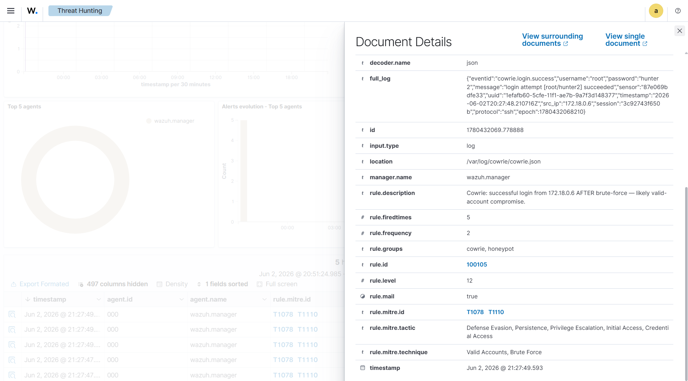

# Brute force into an account takeover

## What happened

An attacker hammered the SSH honeypot with one bad password after another, all
against the `root` account, and then walked straight in once a password finally
worked. This is the most common thing you see hitting any box exposed to the
internet, so it was the first scenario I wanted the lab to catch cleanly.

In my test run the source was `172.18.0.6` and it tried ten passwords in a few
seconds: admin, password, 123456, 12345, root, toor, qwerty, letmein, changeme,
000000. Every one failed. The eleventh attempt used `hunter2` and that one
landed.

## What the honeypot recorded

Cowrie writes every attempt as a line of JSON. Here is one of the failures
straight from `cowrie.json`:

```json
{"eventid":"cowrie.login.failed","username":"root","password":"letmein",
 "src_ip":"172.18.0.6","message":"login attempt [root/letmein] failed", ...}
```


## How Wazuh caught it

Two rules do the work here. The first one flags every single failed login
(rule 100102). On its own that is noisy and not very interesting, so the second
rule watches for a pile of those failures from the same address in a short
window:

```xml
<rule id="100104" level="10" frequency="8" timeframe="120">
  <if_matched_sid>100102</if_matched_sid>
  <same_field>src_ip</same_field>
  <description>Cowrie: SSH brute-force, 8 or more failed logins from $(src_ip) within 120s.</description>
  <mitre><id>T1110</id></mitre>
</rule>
```

One thing that bit me while building this: I first wrote it with
`<same_source_ip/>`, which is the obvious choice, but it never fired. Cowrie's
JSON puts the address in a field called `src_ip`, while `same_source_ip` only
looks at Wazuh's own `srcip` field. Once I switched to
`<same_field>src_ip</same_field>` the correlation started working. Worth
remembering that the field name your correlation keys on actually matters.

The bigger moment is the login that succeeds right after all that noise. That is
rule 100105, and it only fires when a success comes from the same address that
just got flagged for brute forcing. It sits at level 12, the loudest alert in
the whole lab, because a successful login on the back of a brute force is the
point where a guess turns into a real foothold:

```
20:27:45  rule 100104  level 10  brute-force from 172.18.0.6           T1110
20:27:47  rule 100105  level 12  successful login root/hunter2 after   T1078, T1110
```



One honest caveat about rule 100105: it ties the success to the burst on source
IP alone, not on the username. In the honeypot every hit is an attacker so it
does not matter, but on a real network a single NAT or shared egress IP could
carry one person fumbling their password and a different, legitimate person
logging in a moment later, and the rule would call that a compromise. The fix is
to also key the correlation on username so the failures and the success have to
be the same account. The catch is that this would miss spray-and-pray attackers
who flood many accounts and get in on a different one, so the grown-up answer is
to run both, the strict IP+username version to page someone and the looser
IP-only version as a quieter "go look at this source" flag. I walk through
staging that kind of tuning in [`writeup-tuning.md`](writeup-tuning.md).

## MITRE ATT&CK

- T1110 Brute Force (the failed login flood)
- T1078 Valid Accounts (logging in with a credential that now works)

## What I would do next as an analyst

First thing is to figure out if the account and password are real anywhere. In
the lab `root/hunter2` is fake, but on a real estate the question is whether
that password is in use on any production host, and if so it gets reset right
away. After that I would pivot on the source address and look for it in
everything else: VPN logs, web logs, other SSH servers, to see if the same
attacker tried other doors. Then the prevention conversation: kill password
auth on SSH and move to keys, put the box behind something that rate limits
repeated failures, and keep the level 12 "success straight after a failure
burst" alert because that pattern is the one you never want to miss.
