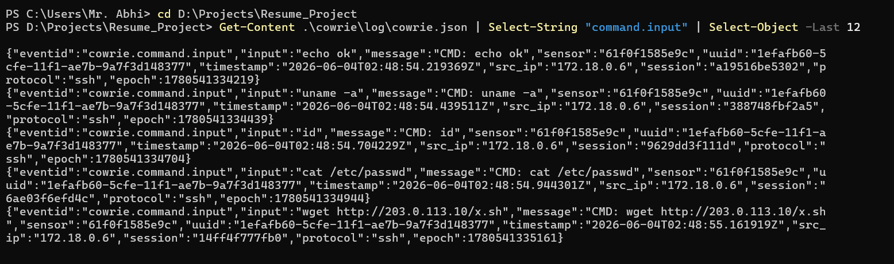

# Looking around after getting in

## What happened

Getting a shell is not the end of an attack, it is the start. Once the attacker
from the brute force write-up was inside the fake `root` account, the next thing
they did was poke around to figure out where they had landed. This is the
"hands on keyboard" phase, and it usually happens in the first few seconds of a
session before anything else.

In my run the commands came in one after another:

```
uname -a
id
cat /etc/passwd
```

Nothing fancy, but that is exactly the point. These are the questions an
attacker asks on a brand new box. What kernel and distro is this? Who am I and
what can I do? Who else has an account here? The honeypot answered all of them,
because it is pretending to be a normal Linux server called `web-prod-01`.

## What the honeypot recorded

Each command shows up in `cowrie.json` as its own `cowrie.command.input` event,
so I get one record per command with the exact text the attacker typed:

```json
{"eventid":"cowrie.command.input","input":"cat /etc/passwd",
 "src_ip":"172.18.0.6", ...}
```



## How Wazuh caught it

There is a base rule that fires on any command at all (rule 100106). On top of
that, a more specific rule looks for the commands that are clearly recon:

```xml
<rule id="100107" level="8">
  <if_sid>100106</if_sid>
  <field name="input" type="pcre2">(?i)\b(uname|whoami|id|hostname|lscpu|uptime|ifconfig|ip\s+a|netstat|ps\b|cat\s+/etc/(passwd|shadow|os-release))\b</field>
  <description>Cowrie: system/recon command observed: $(input)</description>
  <mitre><id>T1082</id><id>T1033</id></mitre>
</rule>
```

The regex is the interesting part. It is a list of the usual discovery commands,
and I kept it readable on purpose so it is easy to add to later. In the test run
it fired three times, once each for `uname -a`, `id`, and `cat /etc/passwd`:

```
20:27:49  rule 100107  uname -a          T1082, T1033
20:27:49  rule 100107  id                T1082, T1033
20:27:49  rule 100107  cat /etc/passwd   T1082, T1033
```


One thing I learned writing this: how Cowrie logs commands depends on how they
are sent. If you push everything as a single SSH command string they arrive as
one event, but if you run them in an interactive session they each become their
own event. The second way gives much cleaner per command alerts, which is why
the attack scripts in this repo run the recon commands one at a time.

## MITRE ATT&CK

- T1082 System Information Discovery (`uname`, reading `/etc/os-release`)
- T1033 System Owner/User Discovery (`id`, `whoami`, reading `/etc/passwd`)

## What I would do next as an analyst

On its own a single `id` is not a crisis, plenty of normal admin work runs these
commands. What makes it matter is the context: these ran seconds after a login
that came straight off a brute force burst. That sequence, guess the password,
get in, immediately enumerate the host, is a real attacker working through their
checklist. So I would tie this back to the same session and source as the
compromise alert and treat the whole thing as one incident rather than a stack
of separate low level events. The story is what sells it, and that is the whole
reason for mapping each step to ATT&CK.

The flip side is that this rule needs real tuning before it goes anywhere near a
production box, because `uname` and `id` are also everyday admin and automation
commands. I pulled that thread out into its own write-up rather than clutter this
one: see [Tuning the detections for the real world](writeup-tuning.md) for how I
would allowlist known admin hosts, escalate recon only when it follows a
compromise, and keep the whole thing honest about false positives.
